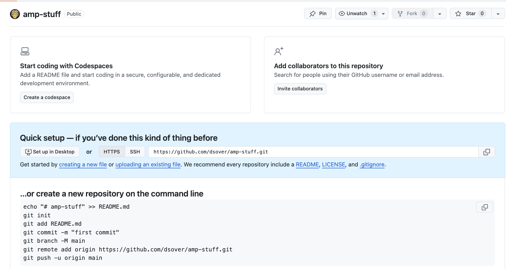

# Amplify Bootstrap Next.js

This is a tool to start a basic amplify application with a next.js frontend.
it is using amplify Gen 2 which will include an amplify directory where you can define custom infrastrucutre.

## Getting Started

### Dependencies

-   [Node.js](https://nodejs.org/en/download/)
-   [AWS CLI](https://docs.aws.amazon.com/cli/latest/userguide/getting-started-install.html)
-   [SSO configured with AWS CLI and a named profile](https://docs.aws.amazon.com/cli/latest/userguide/cli-configure-sso.html)
-   [Github Personal Access Token](https://docs.github.com/en/authentication/keeping-your-account-and-data-secure/managing-your-personal-access-tokens) with write access to your desired repository
-   An Empty git hub repository, it should have the starter page telling you how to add to the repository
-   

### Commands

-   `npm install` - this will install the dependencies
-   `npm link` - this will link the package to your global node_modules
-   `abstrp-init example-app` - this creates a new project in the current directory, it will include a configuration file that you can edit to change the project name and other settings
-   `abstrp-generate` - this will generate stuff, it will initialize a next.js app in the application directory with amplify and various custom files to get you started
-   `abstrp-bootstrap` - this will bootstrap the amplify project, pushing your local changes to your github repository and connecting the branch for deployment in AWS Amplify

### Configuration

### Usage

At this point you will be able to go to the amplify console to see your application, find the deployment, and manage users and other settings.
you can go to the deployment section in amplify to see the status of the deployment and the url of the application. when you push a commit to a branch defined in your configuration file, it will trigger a new deployment.

#### Local Development

there are two ways to do local development depending on what your trying to do.

1. If you are working on the application side, you will need an existing backend infrastructure to work with. for this you can:

    1. go to the amplify console and navigate to the branch you want to work from
    2. in the deployments section click to download the build artifacts
    3. in the downloaded zip file look for an `amplify_outputs.json` file
    4. put this file in the root of your application directory
    5. now you can just run `npm run dev` in the application directory to start the next.js development server. This will allow you to see changes in real time as you make them.

2. If you are working on the backend infrastructure you can follow the [ampx sandbox]('https://docs.amplify.aws/react/reference/cli-commands/') documentation on how to work with the amplify cli to create and manage your development infrastructure.
